### 特殊英文字體

##  特殊英文字體：

Big5EUDC|字符|向量字形|24字形|16字形|Unicode-PUA|Unicode|備註|
----|----|----|----|----|----|----|----|
9FAA|𝓐||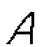|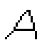|EDC6|1D4D0|
9FAB|𝓑|||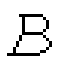|EDC7|1D4D1|
9FAC|𝓒||||EDC8|1D4D2|
9FAD|𝓓||||EDC9|1D4D3|
9FAE|𝓔|||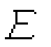|EDCA|1D4D4|
9FAF|𝓕||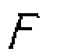|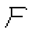|EDCB|1D4D5|
9FB0|𝓖||||EDCC|1D4D6|
9FB1|𝓗||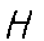|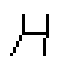|EDCD|1D4D7|
9FB2|𝓘||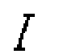||EDCE|1D4D8|
9FB3|𝓙||||EDCF|1D4D9|
9FB4|𝓚||||EDD0|1D4DA|
9FB5|𝓛|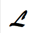|||EDD1|1D4DB|
9FB6|𝓜||||EDD2|1D4DC|
9FB7|𝓝|||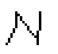|EDD3|1D4DD|
9FB8|𝓞||||EDD4|1D4DE|
9FB9|𝓟|||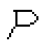|EDD5|1D4DF|
9FBA|𝓠|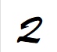|||EDD6|1D4E0|
9FBB|𝓡|||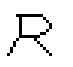|EDD7|1D4E1|
9FBC|𝓢||||EDD8|1D4E2|
9FBD|𝓣||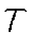|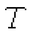|EDD9|1D4E3|
9FBE|𝓤|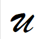|||EDDA|1D4E4|
9FBF|𝓥||||EDDB|1D4E5|
9FC0|𝓦||||EDDC|1D4E6|
9FC1|𝓧|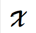|||EDDD|1D4E7|
9FC2|𝓨||||EDDE|1D4E8|
9FC3|𝓩||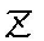|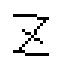|EDDF|1D4E9|
9FC4|𝓪||||EDE0|1D4EA|
9FC5|𝓫||||EDE1|1D4EB|
9FC6|𝓬||||EDE2|1D4EC|
9FC7|𝓭|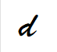|||EDE3|1D4ED|
9FC8|𝓮|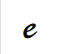|||EDE4|1D4EE|
9FC9|𝓯|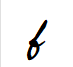|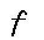|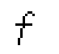|EDE5|1D4EF|
9FCA|𝓰||||EDE6|1D4F0|
9FCB|𝓱|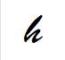|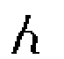|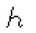|EDE7|1D4F1|
9FCC|𝓲||||EDE8|1D4F2|
9FCD|𝓳|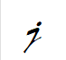|||EDE9|1D4F3|
9FCE|𝓴|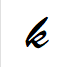|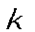||EDEA|1D4F4|
9FCF|𝓵||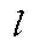||EDEB|1D4F5|
9FD0|𝓶|||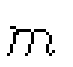|EDEC|1D4F6|
9FD1|𝓷|||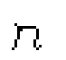|EDED|1D4F7|
9FD2|𝓸||||EDEE|1D4F8|
9FD3|𝓹|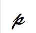|||EDEF|1D4F9|
9FD4|𝓺||||EDF0|1D4FA|
9FD5|𝓻|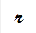|||EDF1|1D4FB|
9FD6|𝓼|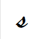|||EDF2|1D4FC|
9FD7|𝓽|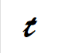|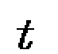|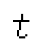|EDF3|1D4FD|
9FD8|𝓾||||EDF4|1D4FE|
9FD9|𝓿|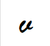|||EDF5|1D4FF|
9FDA|𝔀|||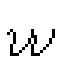|EDF6|1D500|
9FDB|𝔁|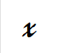|||EDF7|1D501|
9FDC|𝔂||||EDF8|1D502|
9FDD|𝔃|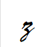||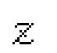|EDF9|1D503|
9FDE|!||||EDFA||斜體感嘆號
9FDF|?||||EDFB||斜體問號

Luke036

2025年9月6日 整理

作為點陣字體檔案館之資料

### 鳴謝：http://code.web.idv.hk/ 做為資料來源！
