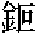
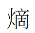

### 化學元素及生化用字

## 化學元素：

|Big5EUDC|字符|向量字形|24字形|16字形|Unicode-PUA|Unicode|IDS(若需要)|備註|
|----|----|----|----|----|----|----|----|----|
|9640|鉕||||E7F9|9255|||
|9641|砈||||E7FA|7808|||
|9642|鍅||||E7FB|9345|||
|9643|鉳||||E7FC|9273|||
|9644|鍩||||E7FD|9369|||
|9645|||||E7FE||⿰金四||
|9646|𮡨||||E7FF|2E868|||
|9647|||||E800||⿰金六||
|9648|||||E801||⿰金七||
|9649|釟||||E802|91DF|||
|964A|釚||||E803|91DA||Big5收錄|

## 化學用字：
|Big5EUDC|字符|向量字形|24字形|16字形|Unicode-PUA|Unicode|IDS(若需要)|備註|
|----|----|----|----|----|----|----|----|----|
|96A8|酞||||E83F|915E|||

## 生化用字：
|Big5EUDC|字符|向量字形|24字形|16字形|Unicode-PUA|Unicode|IDS(若需要)|備註|
|----|----|----|----|----|----|----|----|----|
|96A1|酶||||E838|9176|||
|96A2|腚||||E839|815A|||
|96A3|苷||||E83A|82F7|||
|96A4|呋||||E83B|544B|||
|96A5|脲||||E83C|8132|||

## 物理用字：
|Big5EUDC|字符|向量字形|24字形|16字形|Unicode-PUA|Unicode|IDS(若需要)|備註|
|----|----|----|----|----|----|----|----|----|
|96E0|𪹧||||E877|2AE67|||

Luke036

2025年8月24日 整理

作為點陣字體檔案館之資料

### 鳴謝：http://code.web.idv.hk/ 做為資料來源！
