### 特殊數字字體

## 特殊數字字體：

Big5EUDC|字符|向量字形|24字形|16字形|Unicode-PUA|Unicode|備註|
----|----|----|----|----|----|----|----|
9F7E|||||EDBC||cursive style 0
9FA1|||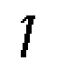|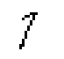|EDBD||cursive style 1
9FA2||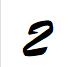||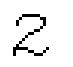|EDBE||cursive style 2
9FA3||||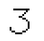|EDBF||cursive style 3
9FA4|||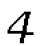|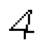|EDC0||cursive style 4
9FA5|||||EDC1||cursive style 5
9FA6||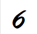|||EDC2||cursive style 6
9FA7|||||EDC3||cursive style 7
9FA8||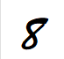|||EDC4||cursive style 8
9FA9|||||EDC5||cursive style 9
9FE0||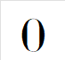|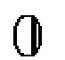||EDFC||decorative style 0
9FE1||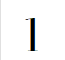|||EDFD||decorative style 1
9FE2||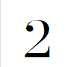|||EDFE||decorative style 2
9FE3||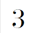||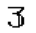|EDFF||decorative style 3
9FE4||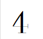|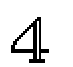|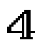|EE00||decorative style 4
9FE5||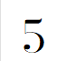|||EE01||decorative style 5
9FE6||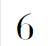|||EE02||decorative style 6
9FE7||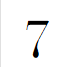|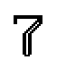|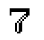|EE03||decorative style 7
9FE8|||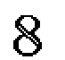||EE04||decorative style 8
9FE9||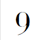|||EE05||decorative style 9
9FEA|𝟶||||EE06|1D7F6|
9FEB|𝟷|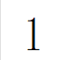|||EE07|1D7F7|
9FEC|𝟸|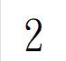|||EE08|1D7F8|
9FED|𝟹|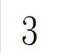|||EE09|1D7F9|
9FEE|𝟺|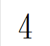||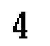|EE0A|1D7FA|
9FEF|𝟻|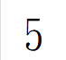|||EE0B|1D7FB|
9FF0|𝟼|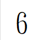|||EE0C|1D7FC|
9FF1|𝟽|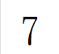||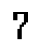|EE0D|1D7FD|
9FF2|𝟾|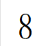||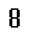|EE0E|1D7FE|
9FF3|𝟿|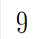|||EE0F|1D7FF|
9FF4|🯰||||EE10|1FBF0|
9FF5|🯱|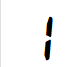|||EE11|1FBF1|
9FF6|🯲|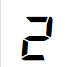|||EE12|1FBF2|
9FF7|🯳|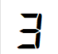||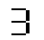|EE13|1FBF3|
9FF8|🯴|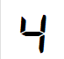||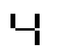|EE14|1FBF4|
9FF9|🯵||||EE15|1FBF5|
9FFA|🯶||||EE16|1FBF6|
9FFB|🯷|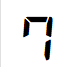|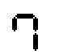||EE17|1FBF7|
9FFC|🯸||||EE18|1FBF8|
9FFD|🯹||||EE19|1FBF9|
9FFE|||||EE1A||8 segment display colon

Luke036

2025年9月6日 整理

作為點陣字體檔案館之資料

### 鳴謝：http://code.web.idv.hk/ 做為資料來源！
