### 廣台方言字

## 廣東方言字：

|Big5EUDC|字符|向量字形|24字形|16字形|Unicode-PUA|Unicode|IDS(若需要)|備註|
|----|----|----|----|----|----|----|----|----|
|A040|袜|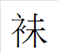|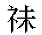|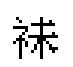|EE1B|889C|||
|A041|孭|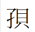|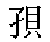|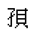|EE1C|5B6D|||
|A042|脷|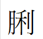|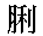|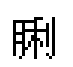|EE1D|8137|||
|A043|𠾐|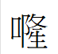|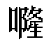||EE1E|20F90|||
|A044|餸|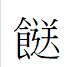|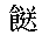||EE1F|9938|||
|A045|啲||||EE20|5572|||
|A046|啫|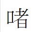|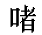||EE21|556B|||
|A047||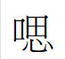|||EE22||⿰口思||
|A048|㗎|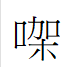|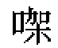|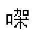|EE23|35CE|||
|A049|啱|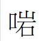|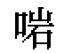||EE24|5571|||
|A04A|喺|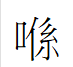|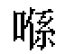|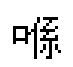|EE25|55BA|||
|A04B|嗱|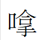|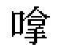|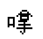|EE26|55F1|||
|A04C|㗒|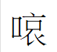|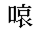||EE27|35D2|||
|A04D|嗰|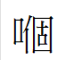|||EE28|55F0|||
|A04E|嘅|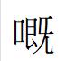||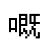|EE29|5605|||
|A04F|嘢|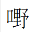|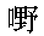||EE2A|5622|||
|A050|嘭|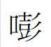|||EE2B|562D|||
|A051|噃|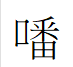|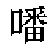||EE2C|5643|||
|A052|嘞|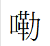|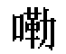||EE2D|561E|||
|A053|嚒|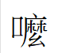||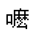|EE2E|5692|||
|A054|糍|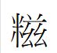|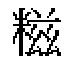|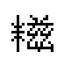|EE2F|7CCD|||
|A055|吚|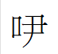|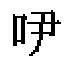|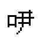|EE30|541A|||
|A056|吓|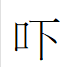|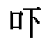|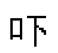|EE31|5413|||
|A057|咗||||EE32|5497|||
|A058|曱||||EE33|66F1|||
|A059|甴||||EE34|7534|||
|A05A|呍||||EE35|544D|||
|A05B|嚤||||EE36|56A4|||
|A05C|嚟||||EE37|569F|||
|A05D|擓||||EE38|64D3|||
|A05E|挮||||EE39|632E|||
|A05F|揸||||EE3A|63F8|||
|A060|攞||||EE3B|651E|||
|A061|乸||||EE3C|4E78|||

## 台灣方言字：
|Big5EUDC|字符|向量字形|24字形|16字形|Unicode-PUA|Unicode|IDS(若需要)|備註|
|----|----|----|----|----|----|----|----|----|
|A0A1|||||EE5A||⿰會勿||
|A0A2|㑑||||EE5B|3451|||
|A0A3|𨑨||||EE5C|28468|||
|A0A4|迌||||EE5D|8FCC|||

Luke036

2025年8月24日 整理

作為點陣字體檔案館之資料

### 鳴謝：http://code.web.idv.hk/ 做為資料來源！
